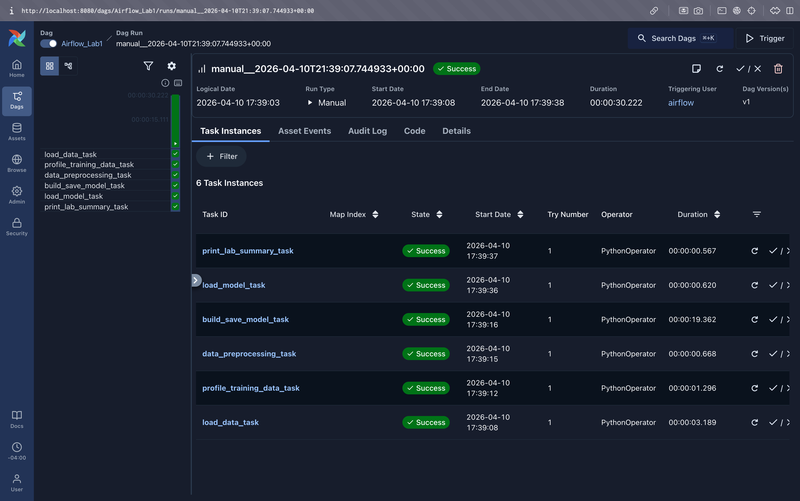
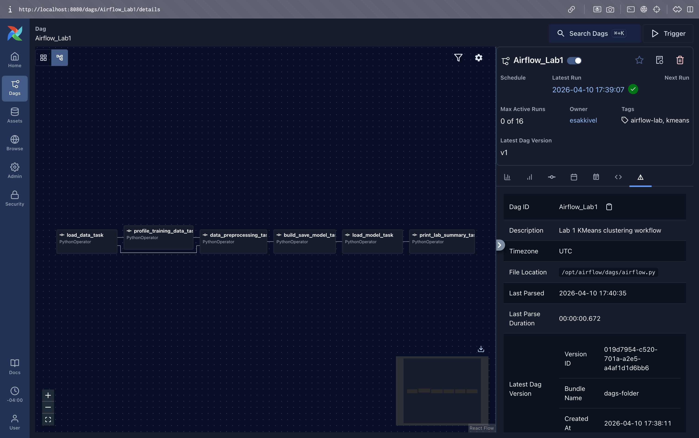

# Airflow Lab 1 Submission

## Goal

This lab runs a small Airflow DAG for an ML workflow. The DAG reads credit card customer data, checks the training data, cleans the data, trains a KMeans clustering model, saves the model, and predicts clusters for the test file.

## Screenshots

### DAG Graph



### Successful Run



## Changes I Made

- I added a fallback import for `PythonOperator`, so the DAG can run on Airflow 2 or Airflow 3.
- I added clear log messages for loading data, preparing columns, saving the model, and making the test prediction.
- I added a data quality task named `profile_training_data_task`.
- I added a new task named `print_lab_summary_task`.
- I added two more rows to `dags/data/test.csv`.
- I added DAG tags: `airflow-lab` and `kmeans`.

## How To Run

1. Open a terminal in the Lab 1 folder.

   ```bash
   cd "Lab_1"
   ```

2. Start Docker Desktop.

3. Use the Airflow Docker setup from the main lab instructions. If you do not have `docker-compose.yaml` in this folder, download the Airflow compose file first.

   ```bash
   curl -LfO "https://airflow.apache.org/docs/apache-airflow/stable/docker-compose.yaml"
   ```

4. Create the folders and `.env` file that Airflow needs.

   ```bash
   mkdir -p ./dags ./logs ./plugins ./config
   echo "AIRFLOW_UID=$(id -u)" > .env
   ```

5. Add these packages to `_PIP_ADDITIONAL_REQUIREMENTS` in `docker-compose.yaml`.

   ```text
   pandas scikit-learn kneed
   ```

6. Start the Airflow database setup.

   ```bash
   docker compose up airflow-init
   ```

7. Start Airflow.

   ```bash
   docker compose up
   ```

8. Open Airflow in the browser.

   ```text
   http://localhost:8080
   ```

9. Log in with the username and password from your Docker compose file. The Airflow compose file may use:

   ```text
   Username: airflow
   Password: airflow
   ```

10. Find the DAG named `Airflow_Lab1`, unpause it, and trigger it.

11. Open the task logs and check these messages:

   ```text
   Loaded [number] rows from file.csv
   Training rows: [number]
   Missing values in model columns
   Mean values for model columns
   Prepared [number] rows with columns: BALANCE, PURCHASES, CREDIT_LIMIT
   Saved KMeans model to [path]
   Predictions for test.csv rows
   Lab 1 summary
   Owner: esakkivel
   ```
